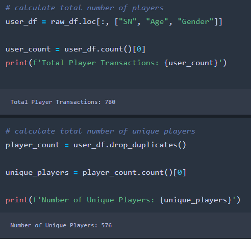

# Heroes-of-Pymoli-Analysis
## Overview
Heroes of Pymoli is a free-to-play game, but players are encouraged to purchase optional items that enhance their playing experience. This objective of this assignment is to generate a report utilizing Pandas Library within Jupyter Notebook that breaks down the game's purchasing data into meaningful insights.

The final report includes:

- Player Count
- Purchasing Analysis (Total)
- Gender Demographics
- Purchasing Analysis (by gender)
- Age Demographics
- Top Spenders
- Most Popular Items
- Most Profitable Items
- Observable Trends
***

### Player Count

