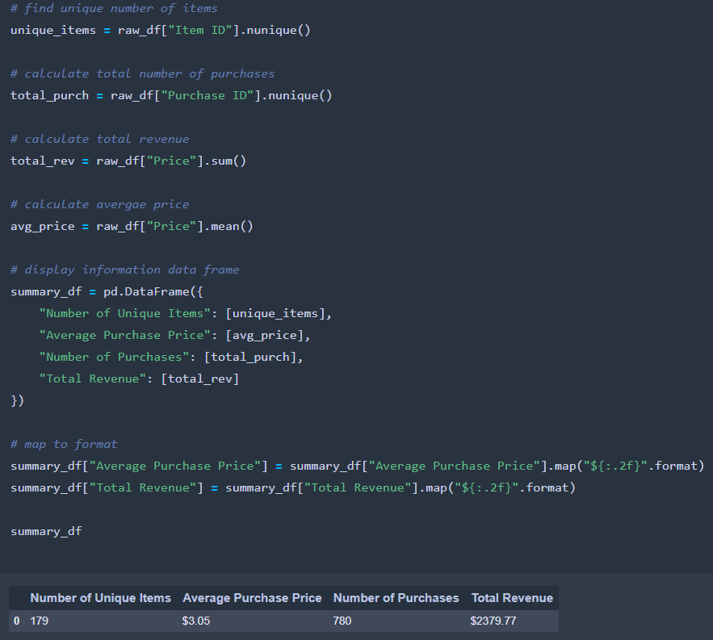
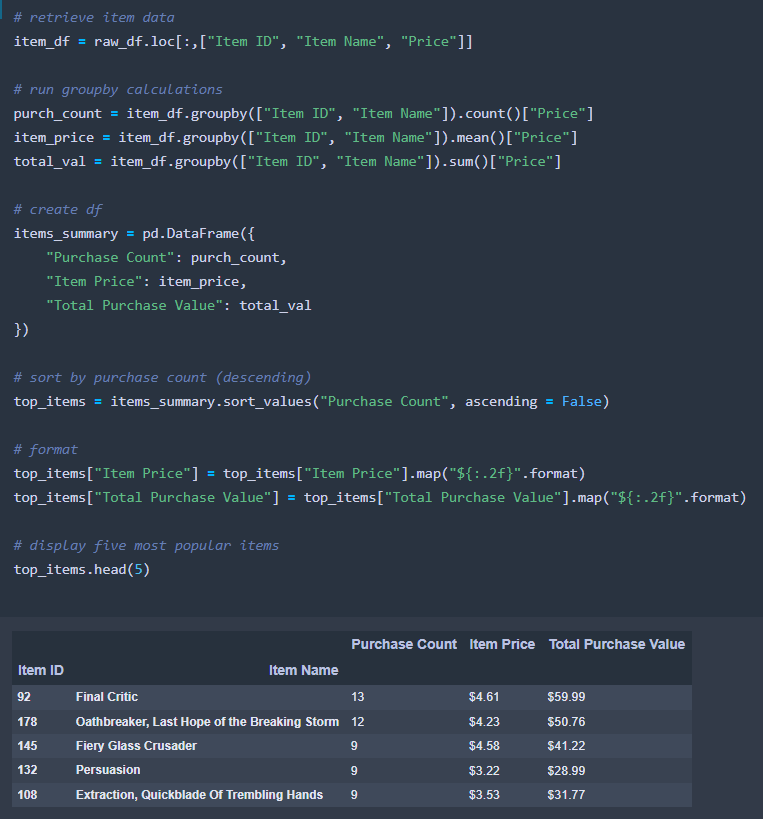

# Heroes-of-Pymoli-Analysis
## Overview
Heroes of Pymoli is a free-to-play game, but players are encouraged to purchase optional items that enhance their playing experience. The objective of this assignment is to generate a report utilizing Pandas Library within Jupyter Notebook that breaks down the game's purchasing data into meaningful insights.

The final report includes:

- Player Count
- Purchasing Analysis (Total)
- Gender Demographics
- Purchasing Analysis (by gender)
- Age Demographics
- Purchasing Analysis (by age)
- Top Spenders
- Most Popular Items
- Most Profitable Items
- Overall Analysis
***

### Player Count

***
### Purchasing Analysis (Total)

***
### Gender Demographics

***
### Purchasing Analysis (by gender)

***
### Age Demographics

***
### Purchasing Analysis (by age)

***
### Top Spenders

***
### Most Popular Items

***
### Most Profitable Items

***

## Overall Analysis
 

- Of the 576 players, the majority identify as male (84.03%). Men tend to spend close to the overall average, around \$3 per transaction. Although men account for the highest volume of purchases, women and non-binary/those who did not disclose gender are the higher value spenders. Based on this information, the marketing and design team would do well to try and expand upon the female and non-binary demographics. 
 

- The peak age demographic falls between the ages of 15-24, which accounts for almost 65% of all players. 
 

- With 780 total transactions spread among 576 unique individuals, the profitability of the game depends on the repeat business of players.

